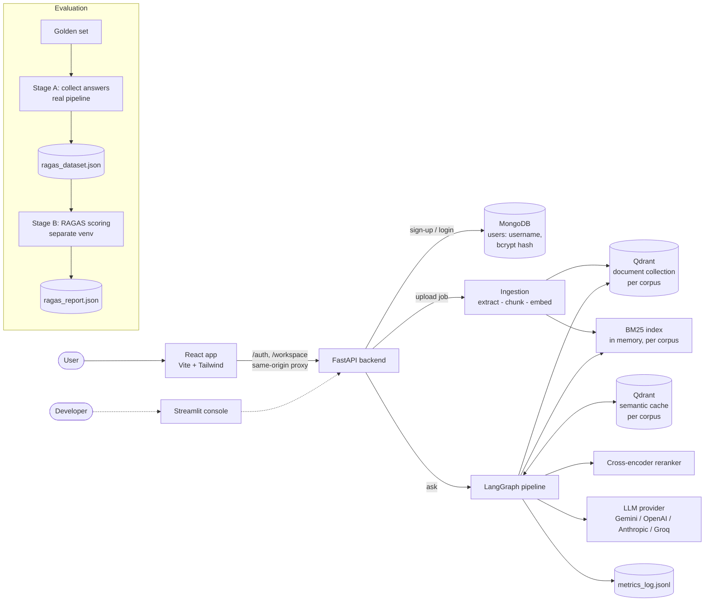
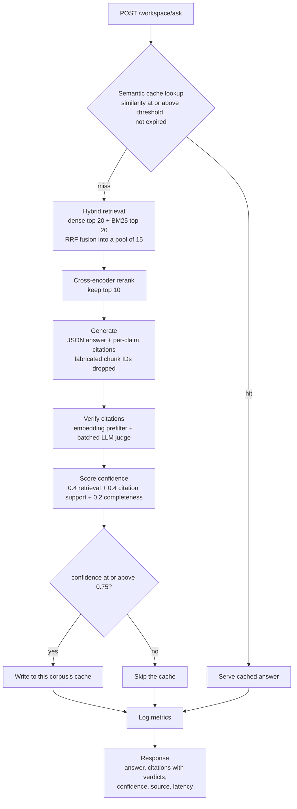
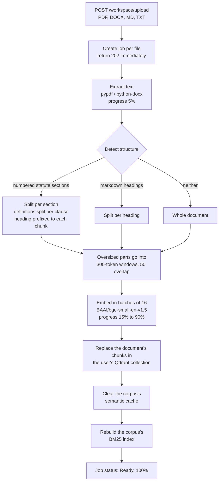

# CiteCache 

CiteCache answers questions from your own documents (policies, contracts, statutes, technical manuals) and backs every claim with a citation that is checked before the answer reaches the user. It pairs hybrid retrieval and cross-encoder reranking with citation verification, a confidence score, and a semantic cache that serves repeat questions without calling the LLM again.

It was evaluated end to end on 127 pages of Indian labour law (three statutes) with a 49-question golden set scored by RAGAS, and the results were cross-checked by an independent judge model: **faithfulness 0.983, context recall 0.988**.

---

## Table of contents
- [What has been built](#what-has-been-built)
- [The problem](#the-problem)
- [The solution](#the-solution)
- [UI screenshots](#ui-screenshots)
- [Features and technical highlights](#features-and-technical-highlights)
- [System architecture](#system-architecture)
- [Request flows: `/ask` and `/upload`](#request-flows)
- [Tech stack](#tech-stack)
- [Evaluation (RAGAS)](#evaluation-ragas)
- [Project structure](#project-structure)
- [Getting started](#getting-started)
- [API reference](#api-reference)
- [Future improvements](#future-improvements)

---

## What has been built

- **A FastAPI backend** that ingests PDF, DOCX, Markdown and text files and answers questions about them through a LangGraph state machine.
- **A React web app** (Vite + Tailwind CSS) with sign-up and login, a Documents page with a **live progress bar** while each file is extracted, chunked, embedded and indexed, and a Query Workspace that shows the answer next to an **Evidence & Citations** panel and a Retrieval Transparency view.
- **User accounts:** usernames and bcrypt-hashed passwords are stored in MongoDB, and the session is a JWT in an HttpOnly cookie, so users stay signed in. Every user gets a **private workspace** (their own corpus) that no other user can read.
- **Multi-corpus isolation:** each workspace or use case gets its own vector collection, semantic cache and BM25 index, so documents and cached answers never cross between them.
- A **Streamlit dashboard** (`app/dashboard/`) is kept as a lightweight developer console for the shared default corpus.
- **A two-stage RAGAS evaluation pipeline**, with a hand-verified golden set, judge-stamped resumable reports, and cross-judge validation.

## The problem

A general-purpose LLM asked about a specific document has three failure modes:

1. **It makes things up.** It answers from its training data, with plausible numbers and section references that aren't in your document.
2. **It can't show its work.** The answer has no traceable source, so users can't check it, and in legal, HR or compliance work an answer you can't check is unusable.
3. **Repeated questions cost the same every time.** The same or reworded question pays full LLM cost and latency on every ask.

Simple RAG setups help but introduce their own problems. Fixed-size chunking cuts sections in half, so the right fact sits in a chunk nobody retrieves. Dense-only retrieval misses exact terms such as section numbers and defined words. And nothing checks that the cited text actually supports the claim.

## The solution

CiteCache puts every question through a pipeline built to catch each of those failures:

| Failure | How CiteCache handles it |
|---|---|
| Wrong or partial section retrieved | **Structure-aware chunking** splits statutes at numbered sections and definitions at individual clauses, and prefixes every chunk with its section heading. **Hybrid retrieval** (dense + BM25, fused with Reciprocal Rank Fusion) then a **cross-encoder rerank** picks the 10 best chunks. |
| Hallucinated facts | The LLM may answer **only from the retrieved chunks**, returns strict JSON with **per-claim citations**, and is told to copy numbers, dates and titles exactly as written. |
| Citations that don't support the claim | **Citation verification:** each claim is checked against the chunk it cites (an embedding prefilter, then a batched LLM judge). Fabricated chunk IDs are dropped. |
| No sense of reliability | A **confidence score** (0.4 × retrieval similarity + 0.4 × citation support rate + 0.2 × completeness) is returned with every answer. |
| Repeated cost and latency | A **semantic cache** serves answers to questions similar to earlier ones. Only high-confidence answers are cached, entries expire after a TTL, and a corpus's cache is cleared whenever its documents change. |
| Out-of-scope questions | The model returns `insufficient_context` instead of guessing when the documents don't contain the answer. |

## UI screenshots

> Screenshots will be added. Put the images in `docs/images/` using the file names below.

| Sign in | Documents with live upload progress |
|---|---|
|  |  |

| Query Workspace with evidence and citations |
|---|
|  |

## Features and technical highlights

**Retrieval**
- **Hybrid search:** dense vectors in Qdrant (`BAAI/bge-small-en-v1.5`) and BM25 (top 20 each), fused with Reciprocal Rank Fusion (k = 60) into a pool of 15 candidates.
- **Cross-encoder reranking** (`cross-encoder/ms-marco-MiniLM-L-6-v2`) narrows the pool to the 10 chunks the LLM sees. The value 10 was chosen from a parameter sweep: it's where coverage of every fact the golden set asks for reached 80/80. Going to 12 added tokens and no coverage.

**Chunking** (`app/ingestion/chunking.py`)
- **Statute-aware splitting:** detects numbered sections by the `N. Title.—` pattern. The em dash separates each heading from its body, which also keeps the table of contents from being mistaken for section starts. Headings that wrap onto a second line are handled.
- **Clause-level definitions:** long definition sections are split per defined term (`2. Definitions - (z) "worker"`), so each chunk's heading names the term it actually defines.
- Every statute chunk carries its section heading **inside the embedded text**, so a query can match on the section name. Markdown is split by heading. Anything else falls back to 300-token windows with 50-token overlap.

**Generation and verification**
- A **provider-agnostic LLM client** covers Gemini, OpenAI, Anthropic and Groq. It backs off using each provider's retry-after hint on rate limits, and repairs and retries structured output.
- Answers come back as **structured JSON** with per-claim citations. Each context chunk is labelled with its document and section so the model can attribute claims correctly across documents.
- **Citation verification** (an embedding prefilter plus a batched LLM judge that fails safe) and **confidence scoring** run on every generated answer.

**Semantic cache**
- The cache is stored in Qdrant, uses a configurable similarity threshold, writes only answers above a confidence threshold, and has a TTL.
- It is **cleared whenever its corpus changes**, so an answer based on an older version of the documents is never served.

**Web app and accounts**
- **Sign-up and login:** passwords are hashed with bcrypt, and usernames are unique and case-insensitive. Login takes the same time whether or not the username exists, so it can't be used to discover accounts.
- **Remembered sessions:** a signed JWT is kept in an HttpOnly, SameSite=Lax cookie, which page scripts can't read. The Vite dev server proxies the API so the app and API share one origin.
- **Live upload progress:** each file becomes a background job that reports each stage: extracting, then embedding (with a count such as *128/345 chunks*), then indexing, then ready. The progress bar shows the real work, not an estimate. Re-uploading a file replaces its old chunks.
- **Evidence panel:** each cited passage is shown as a card with its section, a quote starting at the sentence that supports the claim, a similarity score and a verified / not-supported verdict. Retrieval Transparency lists all 10 retrieved passages and the confidence breakdown.

**Multi-corpus**
- `CorpusProfile` (`app/corpus.py`) gives each corpus its own collections and tuning parameters. Each signed-in user's workspace is a private corpus that can only be reached through the authenticated `/workspace` routes. Any valid name works without setup; add `corpora/<name>.json` to override settings for that corpus.
- Corpus names are validated before they reach Qdrant collection names or file paths, which blocks path traversal.

**Evaluation**
- **Two-stage RAGAS pipeline:** answer collection runs in the app environment, and scoring runs in a separate one, because `ragas` and `langgraph` need incompatible versions of `langchain-core`.
- The **golden set** has 49 questions, each verified against the statute text. Reference answers follow written rules (cite the Act and the section; one provision per sentence) because RAGAS systematically marked correct answers wrong without them.
- **Reliable reports:** every score records which judge produced it, reports from different judges can never be mixed, failed judge calls (for example quota exhaustion) are never recorded as scores, and runs resume where they stopped.
- The evaluation receives exactly the labelled context the model saw, via one shared function, so what's measured can't drift from what the model actually got.

## System architecture



## Request flows

### `/ask`: answering a question



### `/upload`: ingesting documents

In the web app, `POST /workspace/upload` returns immediately with one job per file. The work below then runs in the background, and the browser polls `GET /workspace/jobs` about every 0.7 s to drive the progress bar. Each stage updates the job, and embedding reports progress per batch of 16 chunks.



## Tech stack

| Layer | Technology |
|---|---|
| API | FastAPI, Uvicorn, Pydantic |
| Orchestration | LangGraph |
| Vector store and semantic cache | Qdrant (embedded mode by default; server mode via Docker) |
| Embeddings | sentence-transformers, `BAAI/bge-small-en-v1.5` (local); OpenAI embeddings optional |
| Sparse retrieval | rank-bm25 |
| Reranking | `cross-encoder/ms-marco-MiniLM-L-6-v2` |
| LLMs | Gemini, OpenAI, Anthropic, Groq, through one provider-agnostic client |
| Document parsing | pypdf, python-docx |
| Tokenisation | tiktoken |
| Frontend | React 19, React Router 7, Vite 8, Tailwind CSS 4 |
| Auth | MongoDB (pymongo), bcrypt, PyJWT (HttpOnly cookie sessions) |
| Developer console | Streamlit |
| Evaluation | RAGAS 0.2.15, LangChain (Google GenAI, OpenAI-compatible, HuggingFace) |

## Evaluation (RAGAS)

**Corpus:** 3 Indian labour statutes, 127 pages in total (the Occupational Safety, Health and Working Conditions Code 2020, the Code on Wages 2019, and the Bonded Labour System (Abolition) Act 1976), indexed as 526 chunks.
**Golden set:** 49 questions: 43 answerable (8 Bonded Labour, 14 Code on Wages, 16 OSH Code, 5 cross-document) and 6 deliberately out-of-corpus. RAGAS scores the 43 answerable questions.
**Judge:** `gemini-3.1-flash-lite`. **Pipeline:** 10 reranked chunks per question.

### Final results (43 questions)

| Metric | Score | What it measures |
|---|---|---|
| **Faithfulness** | **0.983** | Share of the answer's claims that are supported by the retrieved context (39/43 questions perfect) |
| **Context recall** | **0.988** | Share of the reference answer that can be found in the retrieved context (42/43 perfect) |
| **Response relevancy** | **0.859** | How directly the answer addresses the question |
| **Factual correctness** | **0.695** | Claim-level F1 overlap between the answer and the reference answer |

### By document

| | Faithfulness | Response relevancy | Context recall | Factual correctness |
|---|---|---|---|---|
| Bonded Labour Act (8) | 1.000 | 0.868 | 1.000 | 0.794 |
| Code on Wages (14) | 0.983 | 0.880 | 1.000 | 0.693 |
| OSH Code (16) | 0.975 | 0.825 | 1.000 | 0.621 |
| Cross-document (5) | 0.983 | 0.899 | 0.900 | 0.780 |

### Cross-judge validation

To make sure the scores don't depend on one judge model, or on Gemini grading its own family's answers, a subset was re-scored by an independent judge from another vendor:

| Metric (7 questions, both judges) | Gemini `gemini-3.1-flash-lite` | Groq `openai/gpt-oss-120b` |
|---|---|---|
| Faithfulness | 1.000 | 1.000 |
| Context recall | 1.000 | 1.000 |
| Response relevancy | 0.895 | 0.880 |
| Factual correctness | 0.821 | 0.811 |

The averages agree closely. Per question, factual correctness varies by up to about ±0.2 between judges, so read its average rather than any single question's score.

**Also measured:** retrieval covers 80 of 80 expected facts across the 43 answerable questions, and the system refused **0 of 43** answerable questions.

**Reproduce:** see [Running the evaluation](#running-the-evaluation).

## Project structure

```
.
├── frontend/                    # React web app (Vite + Tailwind CSS)
│   ├── vite.config.js           # Dev server; proxies /auth and /workspace to the API
│   └── src/
│       ├── App.jsx              # Routes: /login, /signup, /documents, /query
│       ├── context/             # AuthContext (session) and DocumentsContext (documents + upload-job polling)
│       ├── lib/                 # API client, formatting helpers
│       ├── pages/               # LoginPage, SignupPage
│       └── components/
│           ├── auth/            # Shared sign-in / sign-up form
│           ├── layout/          # App shell and sidebar (recent documents with live progress)
│           ├── upload/          # DocumentUpload: drag and drop, per-file progress, document list
│           └── query/           # QueryWorkspace, AnswerView, EvidencePanel, RetrievalTransparency
├── app/
│   ├── api/
│   │   ├── main.py              # FastAPI app: /workspace (signed-in), default and per-corpus routes
│   │   ├── jobs.py              # In-memory upload jobs behind the progress bar
│   │   └── schemas.py           # Request/response models
│   ├── auth/
│   │   ├── routes.py            # /auth/signup, /auth/login, /auth/logout, /auth/me; JWT cookie
│   │   └── users.py             # MongoDB users collection, bcrypt hashing
│   ├── cache/
│   │   └── semantic_cache.py    # Qdrant-backed semantic cache: lookup, write, TTL, clear
│   ├── dashboard/
│   │   └── streamlit_app.py     # Streamlit UI: upload, ask, citations, health
│   ├── eval/
│   │   ├── golden_set.py        # GoldenQuestion model + golden set for the support-docs corpus
│   │   ├── golden_set_labour.py # 49-question golden set for the labour-law corpus
│   │   ├── llm_judge.py         # LLM-as-judge answer grading (in-house eval)
│   │   └── metrics.py           # Keyword and LLM-judge scoring, aggregation
│   ├── generation/
│   │   ├── generate.py          # Answer generation, drops citations to unknown chunk IDs
│   │   ├── llm_client.py        # Multi-provider client, rate-limit backoff, structured-output repair
│   │   ├── prompts.py           # System prompt + chunk provenance labels (shared with the eval)
│   │   └── schemas.py           # GeneratedAnswer / Citation models
│   ├── graph/
│   │   ├── build_graph.py       # LangGraph wiring
│   │   ├── nodes.py             # Graph nodes; read per-corpus settings from the state
│   │   └── state.py             # Graph state definition
│   ├── ingestion/
│   │   ├── chunking.py          # Statute-, clause- and heading-aware chunking with token-window fallback
│   │   ├── embeddings.py        # Local / OpenAI embeddings
│   │   ├── extractors.py        # PDF / DOCX / MD / TXT text extraction
│   │   ├── pipeline.py          # prepare_document + index_chunks (batched, reports progress)
│   │   └── vector_store.py      # Qdrant client and collection helpers
│   ├── metrics/
│   │   └── tracker.py           # Query log, cache hit rate and latency summaries
│   ├── retrieval/
│   │   ├── bm25_index.py        # BM25 index built from a collection
│   │   ├── hybrid.py            # Dense + BM25 retrieval with RRF fusion
│   │   └── rerank.py            # Cross-encoder reranking
│   ├── verification/
│   │   ├── confidence.py        # Confidence score
│   │   └── verify_citations.py  # Embedding prefilter + batched LLM citation judge
│   ├── config.py                # All settings (env-overridable)
│   └── corpus.py                # CorpusProfile: per-corpus collections and parameters
├── scripts/
│   ├── ingest.py                # Ingest a folder into a corpus (--source, --rebuild, --corpus)
│   ├── collect_ragas_dataset.py # RAGAS Stage A: run the real pipeline, record answers + contexts
│   ├── run_eval.py              # In-house eval (keyword + LLM judge) on the support corpus
│   ├── simulate_traffic.py      # Cache behaviour under repeated and paraphrased queries
│   ├── diagnose_cache_threshold.py  # Similarity analysis for choosing the cache threshold
│   └── test_*.py                # Manual smoke scripts for retrieval, hybrid, generation, graph, cache
├── ragas_eval/                  # RAGAS Stage B, in its own virtual environment
│   ├── run_ragas_metrics.py     # Scoring: --corpus, --judge gemini|groq, --ids, --batch-size
│   ├── debug_single_question.py # Surfaces RAGAS exceptions for one question
│   └── requirements.txt
├── data/
│   ├── docs/                    # Sample support-docs corpus (Markdown)
│   ├── docs_labour/             # Labour-law corpus (3 PDFs)
│   ├── ragas_dataset_*.json     # Stage A outputs
│   └── ragas_report_*.json      # Stage B outputs (final, baseline, cross-judge)
├── docker-compose.yml           # Qdrant server (optional)
├── requirements.txt
└── .env.example
```

## Getting started

### Prerequisites
- **Python 3.12**
- **Node.js 20+** and npm, for the web app
- **MongoDB**, for user accounts: a free [MongoDB Atlas](https://www.mongodb.com/atlas) M0 cluster, or MongoDB Community Server running locally
- An API key for **one** LLM provider. The Gemini free tier works; OpenAI, Anthropic and Groq are also supported.
- **Optional:** Docker, if you want to run Qdrant as a server (needed when the API and scripts run at the same time; see the notes below).

The embedding and reranking models download automatically on first use, so no key is needed for those.

### Backend setup

```bash
git clone <your-repo-url> citecache
cd citecache

python -m venv venv
# Windows
venv\Scripts\activate
# macOS / Linux
source venv/bin/activate

pip install -r requirements.txt
```

Create a `.env` file in the project root:

```dotenv
# Pick one provider and set its key
LLM_PROVIDER=gemini                # gemini | openai | anthropic | groq
GEMINI_API_KEY=your-key
GEMINI_MODEL=gemini-3.1-flash-lite
# OPENAI_API_KEY=...   LLM_MODEL=gpt-4o-mini
# ANTHROPIC_API_KEY=...
# GROQ_API_KEY=...     GROQ_MODEL=openai/gpt-oss-20b

# Keep indexed documents across API restarts (the default, true, wipes them on startup)
CLEAR_DATA_ON_STARTUP=false

# Accounts (web app)
MONGODB_URI=mongodb+srv://<user>:<password>@<cluster>/   # or mongodb://localhost:27017
JWT_SECRET=<at least 32 random characters>                 # python -c "import secrets; print(secrets.token_urlsafe(48))"
# MONGODB_DB=citecache
# JWT_EXPIRE_DAYS=7
# COOKIE_SECURE=true        # set in production (HTTPS only)

# Optional tuning (defaults shown)
# RERANK_TOP_N=10
# RERANK_CANDIDATE_POOL_SIZE=15
# CACHE_SIMILARITY_THRESHOLD=0.95
# CACHE_WRITE_CONFIDENCE_THRESHOLD=0.75
# CACHE_TTL_DAYS=7
# CHUNK_SIZE_TOKENS=300
# CHUNK_OVERLAP_TOKENS=50
# GENERATION_MAX_TOKENS=2048
```

### Index documents

Signed-in users upload through the web app into their private workspace, so no setup is needed for them. The ingest script loads documents into a **shared** corpus, which the evaluation and the Streamlit console use:

```bash
python -m scripts.ingest --source data/docs_labour --rebuild
# into a named corpus:
python -m scripts.ingest --source data/docs_labour --rebuild --corpus legal
```

### Run the API and the web app

```bash
uvicorn app.api.main:app --reload          # http://127.0.0.1:8000  (interactive docs at /docs)
```

```bash
cd frontend
npm install
npm run dev                                # http://localhost:5173
```

Open http://localhost:5173, create an account, and you land on **Documents**. Upload a file, watch it index, then go to **Query Workspace**. The optional developer console for the shared default corpus is `streamlit run app/dashboard/streamlit_app.py`.

> **Note:** the first upload or question after the API starts is slow (tens of seconds), because the embedding and reranking models load on first use. Later requests are fast. If the models are already downloaded, setting `HF_HUB_OFFLINE=1` stops the loader from checking huggingface.co at startup.

> **Note:** in the default embedded mode, Qdrant allows only **one process** to open its storage at a time. Stop the API before running `scripts/ingest.py` or an evaluation, or run Qdrant as a server with `docker compose up -d` and set `QDRANT_MODE=server` in `.env`.

### Running the evaluation

```bash
# Stage A (app venv): run the golden set through the real pipeline
python -m scripts.collect_ragas_dataset --corpus labour

# Stage B (separate venv, because ragas needs an older langchain-core)
python -m venv ragas_eval/venv
ragas_eval\venv\Scripts\activate           # or: source ragas_eval/venv/bin/activate
pip install -r ragas_eval/requirements.txt
cd ragas_eval
python run_ragas_metrics.py --corpus labour --judge gemini
# cross-check a subset with an independent judge:
python run_ragas_metrics.py --corpus labour --judge groq --ids b02,w11,o01
```

`ragas_eval/.env` needs `GEMINI_API_KEY`, and optionally `RAGAS_GEMINI_MODEL`, `RAGAS_EMBEDDING_MODEL` and `RAGAS_INTER_QUESTION_DELAY_SECONDS`. The Groq judge reads `GROQ_API_KEY` from the project `.env`. Both stages are resumable: re-running them skips questions that are already done.

## API reference

**Accounts and personal workspace** (used by the web app; requires the session cookie):

| Method | Endpoint | Purpose |
|---|---|---|
| `POST` | `/auth/signup` | Create an account `{"username", "password"}` and sign in |
| `POST` | `/auth/login` | Sign in; sets the HttpOnly session cookie |
| `POST` | `/auth/logout` | Clear the session |
| `GET` | `/auth/me` | The signed-in user |
| `POST` | `/workspace/upload` | Upload files (multipart `files`); returns one job per file (202) |
| `GET` | `/workspace/jobs` · `/workspace/jobs/{id}` | Upload progress: stage, percent, chunks done / total |
| `GET` | `/workspace/documents` | The user's indexed documents and chunk counts |
| `POST` | `/workspace/ask` | Ask; returns the answer plus evidence cards, retrieved passages and the confidence breakdown |

**Shared corpora** (no sign-in; used by scripts and the Streamlit console):

| Method | Endpoint | Purpose |
|---|---|---|
| `GET` | `/health` | Status, LLM provider, chunks indexed (default corpus and each loaded corpus) |
| `POST` | `/upload` | Upload files (multipart `files`) to the default corpus |
| `POST` | `/ask` | Ask a question: `{"question": "..."}` |
| `POST` | `/reset` | Clear the default corpus's documents and cache |
| `POST` | `/corpora/{corpus}/upload` | Upload into a named corpus |
| `POST` | `/corpora/{corpus}/ask` | Ask within a named corpus |
| `POST` | `/corpora/{corpus}/reset` | Clear a named corpus |

```bash
curl -F "files=@data/docs_labour/code_on_wages_2019.pdf" http://localhost:8000/corpora/legal/upload
curl -H "Content-Type: application/json" \
     -d '{"question": "How often must minimum wages be revised?"}' \
     http://localhost:8000/corpora/legal/ask
```

An `/ask` response includes `answer`, `citations` (each with `claim`, `source` and a `supported` verdict), `confidence`, `source` (`generated` or `cache`), `latency_ms` and `insufficient_context`.

## Future improvements

**Security and multi-user**
- Put the shared, unauthenticated routes (`/upload`, `/ask`, `/reset`, `/corpora/...`) behind an admin role, or remove them in production. Today only the `/workspace` routes require sign-in.
- Rate-limit `/auth/login` to slow down password guessing, and replace the permissive CORS policy (`allow_origins=["*"]`) with an explicit list of allowed origins.
- Keep upload jobs in MongoDB rather than in memory, so an API restart doesn't lose the progress of in-flight uploads (already-indexed documents are unaffected).

**Product**
- A **corpus type selector** in the web app (legal, HR, finance, technical, ...) stored on the user's workspace and mapped to a vetted prompt snippet (a fixed list, not free text, to avoid prompt injection).
- Delete a document from the workspace, and support several named workspaces per user.
- Load the embedding and reranking models when the API starts, so the first user request isn't slow.
- Replace filename-based document-type hints with the user-selected corpus type, or an LLM classifier.
- Pluggable **per-corpus chunkers and prompt templates**.
- Streamed answers.

**Retrieval and answer quality**
- Strip PDF page furniture (repeated footers, page numbers, broken hyphenation) at extraction time.
- Recalibrate the **citation prefilter** threshold. At 0.3 it currently rejects nothing, since even unrelated claim/chunk pairs score at least 0.43.
- Work on the weakest area: factual correctness on the OSH Code (0.621), mainly on multi-part answers.

**Engineering**
- Automated `pytest` tests and CI (the `scripts/test_*.py` files are manual smoke scripts).
- Use Qdrant server mode by default so the API and scripts can run together.
- Tag metrics-log entries by corpus, and keep runtime logs out of version control.
- Replace the deprecated FastAPI `on_event` startup hook with a lifespan handler.
- Keep `.env.example` in sync with `app/config.py`.
